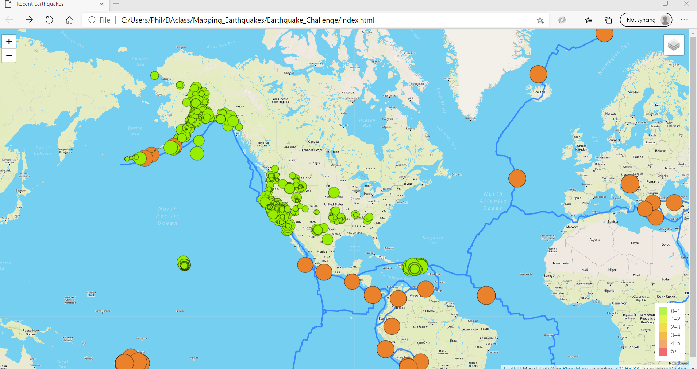
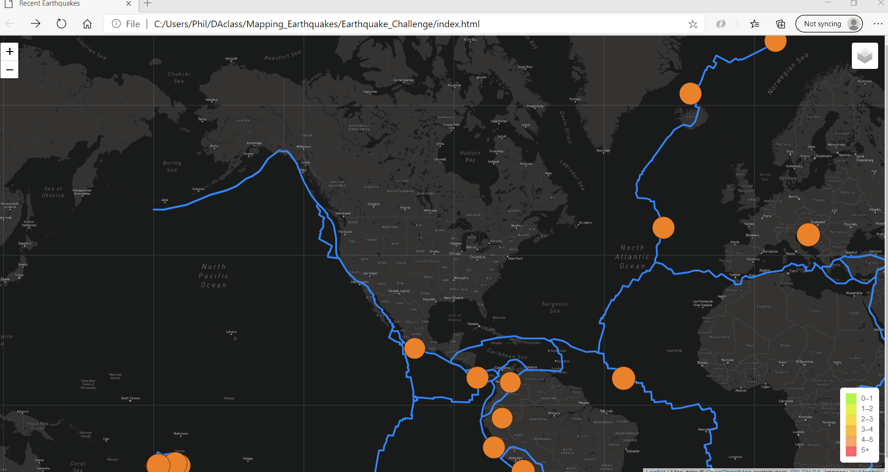

# Mapping_Earthquakes

This project mapped recent earthquake activity using:
- mapbox for the underlying maps
- earthquake.usgs.gov for recent earthquake activity
- files provided by the client, and stored on GitHub, for the layout of the tectonic plates

### Sample Images

